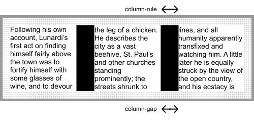
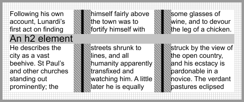

# CSS Multi-column Layout Module Level 1

#### W3C Working Draft, 12 February 2021

## 抄録

本仕様書は、Web 用スタイルシート言語である CSS における多段組について規定します。本仕様で規定されている機能を利用して、多段組に段間やルーラーを設けて本文を流すことができます。

CSSは、構造化された文書（HTMLやXMLなど）の画面や紙面などでの描画を記述するための言語である。

## この文書の意義

このセクションでは、この文書の発行時の状態を説明します。他の文書がこの文書に取って代わることがあります。現在のW3C出版物及びこの技術報告書の最新改訂版のリストは、https://www.w3.org/TR/ のW3C技術報告書インデックスに掲載されています。

この文書は、CSS作業部会が作業草案として発行したものでです。策定中草案として出版されたことは、W3Cメンバーシップによる承認を意味するものではありません。

この文書は草案であり、いつでも他の文書に更新されたり、置き換えられたり、廃止されたりする可能性があります。この文書を策定中以上のものとして引用することは不適切です。

以下のように、タイトルに仕様コード`css-multicol`"を含めて`GitHub`に課題を提出することでフィードバックを送ってください(推奨)。『[css-multicol]...コメントの要約....』のようにしてください。すべての問題とコメントはアーカイブされます。また、(アーカイブされた)公開メーリングリスト`www-style@w3.org`にフィードバックを送ることもできます。

この文書は、2020年9月15日のW3Cプロセス文書に準拠しています。

この文書は、W3C特許ポリシーの下で運営されているグループによって作成されました。W3Cは、グループの成果物に関連して行われた特許開示の公開リストを維持しています。本質的クレームを含むと考えられる特許を実際に知っている個人は、W3C特許ポリシーの第6項に従って情報を開示しなければなりません。

## 1. 序章

(このセクションは規範ではありません)

ここでは、CSSにおける多段組みレイアウトについて説明する。このドキュメントで説明する機能を使用することで、スタイルシートは、要素の内容を多段組みで指定することができます。

CSSの他のレイアウト方法は、親要素に適用されると、直接の子要素の表示プロパティを変更します。例えば、3列のグリッド・レイアウトが作成された場合、グリッド・コンテナの直接の子要素はグリッド・アイテムとなり、必要に応じて追加の行が作成され、セルごとに1つの要素がカラム・トラックに配置されます。

しかし、マルチカラムコンテナの子要素は通常のフローを継続し、そのフローは複数のカラムに配置されます。これらの列は柔軟なインラインサイズを持っているため、表示される列のサイズや数を変更することで利用可能なスペースに対応します。

多段組みをCSSで記述するのは簡単です。以下に簡単な例を示します。

#### 例1

```
body { column-width: 12em }
```

> 正確なカラム数は利用可能なスペースに依存します。

カラム数はスタイルシートで明示的に設定することもできます。

#### 例2

```
body { column-count: 2 }
```

> この場合、カラムの数は固定で、カラムの幅は利用可能な幅に応じて変化します。

短縮型のcolumnsプロパティを使用して、1つの宣言でどちらか、または両方のプロパティを設定することができます。

#### 例3
これらの例では、カラムの数、カラムの幅、および数と幅の両方がそれぞれ設定されています。

```
body { columns: 2 }
body { columns: 12em }
body { columns: 2 12em }
```

#### 例4

段間とルーラの指定です。

```
body {
  column-gap: 1em;
  column-rule: thin solid black;
}
```

> 上の例の最初の宣言では、段間を1emに設定しています。段間はパディング領域に似ています。隙間の中央には、『column-rule』プロパティによって記述されるルーラーがあります。

`column-rule`プロパティの値は、`CSS`の`border`プロパティの値と似ています。`border`と同様に、`column-rule`は短縮プロパティです。

#### 例5

この例では、上記の例の短縮型の`column-rule`プロパティを展開して指定しています。

```
body {
  column-gap: 1em;
  column-rule-width: thin;
  column-rule-style: solid;
  column-rule-color: black;
}
```

#### 例6

column-fillとcolumn-spanプロパティは、段組の見栄えを指定します。

この例では、列がほぼ同じ長さになるように設定されています。また、`h2`要素はすべての列にまたがるように設定されています。

```
div { column-fill: balance }
h2 { column-span: all }
``` 

この仕様では、10個の新しいプロパティを導入していますが、そのすべてが上記の例で使用されています。

すべての列プロパティが初期値を持つ場合、要素のレイアウトは、1つの列だけを持つ複数列レイアウトと同じになります。

#### 例7

> 列の段間（斜めのハッチング）と列のルーラー（定規）は、パディング（十字のハッチング）を持つ複数列コンテナのこのサンプルのレンダリングで示されています。ハッチングされた部分は、説明のためだけに存在しています。実際の実装では、これらの領域は背景によって決定されます。2番目の画像は、列のルーラー（定規）を持つ複数列コンテナのレンダリングを示しています。


<!-- {width=xxx} -->

### 1.1. 値の定義

本仕様は、[CSS-VALUES-3]の値定義構文を用いて、[CSS21]のCSSプロパティ定義規定に従う。本仕様で定義されていない値の型は、CSS Values & Units [CSS-VALUES-3]で定義されている。他のCSSモジュールと組み合わせることで、これらの値型の定義が拡張されることがある。

定義に列挙されているプロパティ固有の値に加えて、本仕様で定義されているすべてのプロパティは、CSS全体のキーワードをプロパティ値としても受け入れる。可読性のために、それらは明示的に繰り返していない。

## 2. 多段組み

`column-width`または`column-count`プロパティが`auto`でない要素は、マルチカラムコンテナ（略して`multi-col`コンテナ）を確立し、マルチカラムレイアウトのためのコンテナとして機能する。

従来のCSSボックス・モデルでは、要素の内容は対応する要素のコンテンツ・ボックスに流れ込みます。マルチカラム・レイアウトでは、カラム・ボックス（略してカラム）と呼ばれる匿名の断片化コンテナで形成された断片化コンテキストが導入されます。これらのカラム・ボックスは、マルチカラム・コンテナのコンテンツが流れる独立したブロック・フォーマット・コンテキストを確立し、その非配置子要素のための包含ブロックを形成します。

#### 例8

> この例では、このようなルールで画像の幅を設定しています。

```
img { 
  display: block. 
  width: 100%. 
}
```

> カラムボックスが新しいブロックフォーマットのコンテキストを作成することを考えると、幅はカラムボックスに対して相対的に計算されます。そのため、画像がカラムボックスからはみ出すことはありません。


#### 例9

> カラムボックスが新しいブロックフォーマットのコンテキストを作成することを考えると、multicolコンテナの最初の子要素に設定されたトップマージンは、multicolコンテナの余白では崩れません。


複数列レイアウト内に表示されるフロートは、フロートが表示される列ボックスを基準にして配置されます。

#### 例10

> この例では、この`CSS`フラグメントは画像の表示を記述しています。

```
img { 
  display: block. 
  float: right.
}
```

> HTMLでは、「鶏の足」という文末の後に画像が表示されます。


ブロック軸の列ボックスでオーバーフローした内容が断片化され、次の列ボックスで継続されます。

> 注：無名のボックスである列ボックスは、絶対的に配置されたボックスの包含ブロックにはなりません。そのようなボックスのための包含ブロックを確立する`position`プロパティは、マルチコルコンテナに適用され、それが主ボックスとなります。

#### 例11

> この例では、『multi-column container』は『position: relative』、これによって内容ブロックになります。画像は複数列コンテナの直接の子であり、『position: absolute』を持ちます。画像は、複数列コンテナの位置を取り、カラムボックスの位置ではなく、複数列コンテナの位置を取ります。

```
.container {
  position: relative;
  column-count: 3;
}
img {
  position: absolute;
  top: 20px;
  left: 40px;
}
```


カラムボックスは、マルチコルコンテナのインラインベース方向に並べられ、マルチコルラインに配置されています。カラム幅は、インライン方向のカラムボックスの長さです。カラムの高さは、ブロック方向のカラムボックスの長さである。行内のすべてのカラムボックスは同じカラム幅を持ち、行内のすべてのカラムボックスは同じカラム高さを持つ。

マルチカラムコンテナ内の各マルチカラム行内では、隣接するカラムボックスはカラムギャップによって区切られており、その中にはカラムルールが含まれている場合があります。同じ複数列コンテナ内のすべての列ギャップは等しくなります。同じ複数列コンテナ内のすべての列規則が表示されている場合は、それもすべて等しくなります。

最も単純なケースでは、マルチカラムコンテナは1行のカラムのみを含み、各カラムの高さはマルチカラムコンテナのコンテンツボックスの使用済みの高さと同等になります。しかし、断片化またはスパナは、マルチカラムコンテナの内容を複数のマルチカラム行に分割することができます。

複数列コンテナがページ分割されている場合、各列の高さはページによって制約され、内容は次のページの列ボックスの新しい行に続けられます。

この効果は、スパング要素が複数列のコンテナを分割したときにも同じです：スパング要素の前の列は、その内容に合わせてバランスが取れて短くなります。スパニング要素の後の内容は、新しい行の後続の列ボックスに流れ込みます。

#### 例12


したがって、マルチカラムコンテナは、その内容が一連のマルチカラム行とマルチカラムスパナで構成された新しい独立した書式設定コンテキストを確立する通常のブロックコンテナです。各マルチカラム行は、そのカラムボックスのためにマルチカラム書式設定コンテキストを確立するブロックレベルボックスとして動作し、各スパナは、通常通り、その表示値に応じた型で独立した書式設定コンテキストを確立するブロックレベルボックスとして動作します。

入れ子になった複数列コンテナは許可されていますが、実装固有の制限がある場合があります。

> 注意：カラムボックスにプロパティ/値を設定することはできません。例えば、特定のカラムボックスの背景を設定することはできませんし、カラムボックスにはパディング、マージン、ボーダーの概念がありません。将来の仕様では、追加機能が追加される可能性があります。例えば、幅の異なるカラムや背景の異なるカラムがサポートされるかもしれません。

> 注意：ビューポートよりもカラムの高さが大きいマルチコルコンテナは、アクセシビリティの問題を引き起こす可能性があります。

## 3. コラムの数と幅

複数カラムのコンテンツをレイアウトする際には、カラムの数と幅を見つけることが基本となります。これらのプロパティは、カラム数と幅を設定するために使用されます。

* column-count
* column-width

3番目のプロパティであるcolumnsは、column-widthとcolumn-countの両方を設定する略式プロパティです。

明示的な列の区切り、内容、高さの制約などの他の要因が、実際の列の数や幅に影響を与えることがあります。

### 3.1. 列のサイス：column-widthプロパティ

|名前|列幅|
|-|-|
|値 |auto または 長さ『0〜∞』|
|初期値|auto|
|適用対象|block containers except table wrapper boxes|
|継承|なし|
|割合|該当なし|
|計算値|the keyword auto or 絶対値|
|正準順序|文法ごと|

このプロパティは、マルチコルコンテナ内のカラムの幅を記述します。

* __auto__
  カラムの幅が他のプロパティ(例えば、自動ではない値を持っている場合は、カラムカウント)によって決定されることを意味します。

* __<length [0,∞]>__
  最適なカラム幅を記述します。実際の列幅は、（利用可能なスペースを埋めるために）広くしてもよいし、（利用可能なスペースが指定された列幅よりも小さい場合のみ）狭くしてもよい。負の値は認められません。使用される値は、最小1pxにクランプされます。

#### 例13

> 例えば、以下のスタイルシートを考えてみましょう。

```
div {
  width: 100px;
  column-width: 45px;
  column-gap: 0;
  column-rule: none;
}
```

> 幅100pxの要素の中には、幅45pxのカラムが2つ入る余地があります。空いたスペースを埋めるために、実際のカラムの幅は50pxに増加します。

#### 例14

> また、このスタイルシートも考えてみてください。

```
div {
  width: 40px;
  column-width: 45px;
  column-gap: 0;
  column-rule: none;
}
```

> 空いているスペースは指定された列幅よりも小さくなるため、実際の列幅は小さくなります。

縦書きのテキストでもカラム幅が使えるようにするために、カラム幅とは、カラム内の行ボックスの長さを意味します。

> 注意：列幅を多少柔軟にする理由は、多くの画面サイズに対応できるスケーラブルなデザインを実現するためです。正確なカラム幅を設定するには、カラムギャップとマルチコルコンテナの幅（横書きテキストを想定）も指定する必要があります。


### 3.2. カラム数: column-countプロパティ

|名前|column-count|
|-|-|
|値|auto｜整数1〜∞|
|初期値|auto|
|適用対象|ボックスを含有しないテーブルを除くブロック|
|継承|なし|
|割合|該当なし|
|算出値|指定値|
|正準順序|文法ごと|
|アニメーション可能|計算された値による|

このプロパティは、マルチコルコンテナの列数を記述します。

* auto
  カラム数が他のプロパティ(例えば、自動ではない値を持つ場合はカラム幅)によって決定されることを意味します。

* 整数1〜∞
  要素の内容が流れる最適なカラム数を記述します。`column-width`と`column-count`の両方が自動ではない値を持つ場合、整数値は最大のカラム数を記述します。

#### 例15

```
body { column-count: 3 }
```

### 3.3. columnsプロパティ（『column-width』と『column-count』の短縮記法）

|名前|columns|
|-|-|
|値を指定します。	<'column-width'> || <'column-count'>|
|イニシャル|個別のプロパティを参照してください。|
|該当するもの|個別の物件を見る|
|継承|個別のプロパティを参照|
|パーセンテージ|個別物件を参照|
|計算値|個々のプロパティを参照|
|アニメーションの種類|個々のプロパティを参照してください。|
|正準順序|文法ごと|

column-widthとcolumn-countを設定するための略式プロパティです。省略された値は初期値に設定されます。

#### 例16

> ここでは、columnsプロパティを使用した有効な宣言をいくつか紹介します。

```
columns: 12em;      /* column-width: 12em; column-count: auto */
columns: auto 12em; /* column-width: 12em; column-count: auto */
columns: 2;         /* column-width: auto; column-count: 2 */
columns: 2 auto;    /* column-width: auto; column-count: 2 */
columns: auto;      /* column-width: auto; column-count: auto */
columns: auto auto; /* column-width: auto; column-count: auto */
```

### 3.4. 擬似アルゴリズム（Pseudo-algorithm）

以下の擬似アルゴリズムは、『N』`column-count`と『W』`column-width`の使用値を決定します。擬似アルゴリズムにはもう一つの変数があります。『U』はmulti-columnコンテナの幅です。

> 注記：複数列コンテナの使用済み幅『U』は、要素の内容に依存することがありますが、その場合は『column-count』と『column-width』プロパティの計算値にも依存します。この仕様では、『U』がどのように計算されるかは定義されていません。別のモジュール（おそらく、Basic Box Model [CSS3BOX] や Intrinsic & Extrinsic Sizing Module [CSS3-SIZING]）がこれを定義することが期待されています。

`floor(X)`関数は、最大の整数`Y ≤ X`を返します。

```
(01)  if ((column-width = auto) and (column-count = auto)) then
(02)      exit; /* not a multicol container */
(03)  if column-width = auto then
(04)      N := column-count
(05)  else if column-count = auto then
(06)      N := max(1,
(07)        floor((U + column-gap)/(column-width + column-gap)))
(08)  else
(09)      N := min(column-count, max(1,
(10)        floor((U + column-gap)/(column-width + column-gap))))
And:

(11)  W := max(0, ((U + column-gap)/N - column-gap))
```

自動繰り返し列の数を見つける目的のために、UAは列のサイズを0で除算されないようにUAが指定した値に下げなければならない。このフロアは1px以下であることが提案されている。

ページ化されたメディアのような断片化されたコンテキストでは、ユーザーエージェントはこの計算を断片ごとに実行してもよい。

列数に対する使用値は、明示的な列の改行や制約された列の高さを考慮せずに計算されますが、実際の値はこれらを考慮に入れています。

#### 例17

> この例では、明示的な列の区切りにより、実際の列数が使用済みの列数よりも多くなっています。

```
div {
  width: 40em;
  columns: 20em;
  column-gap: 0;
}
p {
  break-after: column;
}
```

```

<div>
  <p>one
  <p>two
  <p>three
</div>
```


#### 例18

> 実際のカラム数は、使用されているカラム数よりも少ない場合があります。この例を考えてみましょう。

```
div {
  width: 80em;
  height: 10em;
  columns: 20em;
  column-gap: 0;
  column-fill: auto;
}
```
```
<div>foo</div>
```

> 計算された列数は自動、使用された列数は4、実際の列数は1です。

### 3.5. スタッキングコンテキスト

`multi-column`コンテナ内のすべてのカラムボックスは同じスタッキングコンテキストにあり、その内容の描画順序はCSS2.1で指定されている通りである。カラムボックスは新たなスタッキングコンテキストを確立しない。

## 4. 段間とルーラー（定規）

カラムギャップとカラムルールは、同じmulticolコンテナ内のカラム間に配置されます。カラムギャップとカラムルールの長さは、カラムの高さと同じです。カラムギャップはスペースを取ります。つまり、カラムギャップは、隣接するカラム（同じmulticolコンテナ内）のコンテンツを押しのけてしまいます。

カラム・ルールは、カラム・ギャップの中央に、マルチコル・コンテナの対向するコンテンツの端に終点を置いて描かれます。カラムルールはスペースを取りません。つまり、カラムルールの存在や太さが他の何かの配置を変えることはありません。カラムルールがそのギャップよりも広い場合、隣接するカラムボックスはルールと重なり、ルールはマルチコルコンテナのボックスの外にはみ出してしまう可能性があります。列規則は、マルチコルコンテナの境界線のすぐ上に描かれます。スクロール可能なマルチコルコンテナの場合、マルチコルコンテナのボーダーと背景は明らかにスクロールされませんが、ルールは列とともにスクロールする必要があることに注意してください。カラムルールが描かれるのは、両方のカラムが内容を持つ2つのカラムの間だけです。

### 4.1. column-gapプロパティ: 段間

column-gapプロパティは[CSS3-ALIGN]で定義されています。

複数列の書式設定のコンテキストでは、`column-gap`プロパティの`normal`の値は1emである。これにより、初期値が使用されているときに列が確実に読み取れるようになります。カラム間にカラムルールがある場合は、ギャップの中央に表示されます。

### 4.2. column-rule-colorプロパティ: 列規則の色

|名前|column-rule-color|
|-|-|
|値|色（列ルーラー（定規）の色を指定します。）|
|初期値|現在の色|
|適用対象|マルチカラーコンテナ|
|継承|なし|
|割合	該当なし|
|計算された値|計算された色|
|正準順序|文法ごと|
|アニメーションタイプ|計算値タイプによる|

### 4.3. column-rule-styleプロパティ: ルーラーの形状

|名称|コラムルールスタイル|
|-|-|
|値|line-style|
|初期値|なし|
|適用対象|multi-col containers|
|継承|なし|
|割合|該当なし|
|計算値|指定されたキーワード|
|正準順序|文法ごと|
|アニメーションの種類|discrete|

* line-style
  none | hidden | dotted | dashed | solid | double | groove | ridge | inset | outset

`column-rule-style`プロパティは、要素の列間のルールのスタイルを設定する。`line-style`値は、`collapsing border model`と同じように解釈されます。

none値は、`column-rule-width`の計算値を0に強制します。

### 4.4. column-rule-widthプロパティ: 列規則の幅

|名前|column-rule-width|
|-|-|
|値|行幅|
|初期値|ミディアム|
|適用対象|multi-col containers|
|継承|なし|
|割合|該当なし|
|計算値|絶対長|
|正準順序|文法ごと|
|アニメーションタイプ|計算値タイプによる|

このプロパティは、列間のルーラー（定規）の幅を設定します。負の値を指定することはできません。

### 4.5. column-ruleプロパティ: 列ルーラー（定規）の短縮形

|名前|column-rule|
|-|-|
|値|`column-rule-width`, `column-rule-style`, `column-rule-color`|
|初期値|個別のプロパティを参照してください。|
|該当するもの|個別の物件を見る|
|継承|個別のプロパティを参照|
|パーセンテージ|個別物件を参照|
|計算値|個々のプロパティを参照|
|アニメーションの種類: 個々のプロパティを参照してください。|
|正準順序|文法ごと|

このプロパティは、スタイルシート内の`column-rule-width`、`column-rule-style`、`column-rule-color`を同じ場所に設定するための略語です。省略された値は初期値に設定されます。

#### 例19

> この例では、列のルーラー（定規）と段間は同じ幅を持っています。したがって、それらは全く同じスペースを占めることになります。

```
body {
  column-gap: 35px;
  column-rule-width: 35px;
  column-rule-style: solid;
  column-rule-color: black;
}
```



## 5. コラムの区切り

コンテンツが複数の列にレイアウトされている場合、ユーザエージェントは、列の区切りがどこに置かれるかを決定しなければならない。コンテンツを列に分割する問題は、コンテンツをページに分割する問題と似ており、CSS 2.1のセクション13.3.3 [CSS21]で記述されている。

列の改行をページの改行と同じプロパティで記述できるようにするために、`break-before`、`break-after`、`break-inside`の3つの新しいプロパティが導入されています。

### 5.1. the break-before, break-after, break-inside properties: 細分化のコントロールについて

`break-before`、`break-after`、`break-inside`は、[`CSS3-BREAK`](https://www.w3.org/TR/css-break-3/)で定義されている。

## 6. 段抜き

### 6.1. column-span property: 段抜き 


|名前|column-span|
|-|-|
|値|none または all|
|初期値|なし|
|適用対象|in-flow block-level elements|
|継承|なし|
|割合|該当なし|
|計算値|指定されたキーワード|
|正準順序|文法ごと|
|アニメーションの種類|discrete|

* none
  要素が複数の列にまたがることはありません。
* all
  要素は、`out-of-flow`で取り出され、同じブロック組版文脈の中で最も近い複数コラムの祖先のすべての列にまたがって広がります。要素の前に現れる通常フローの内容は、要素が現れる前の直前の複数コラム行のすべての列にまたがって自動的にバランスをとる。要素は独立した書式設定コンテキストを確立する。

> 『out-of-flow』とは、ボックスは、期待される位置と周囲のコンテンツとの相互作用から抽出され、親の書式設定コンテキストでのコンテンツの通常の流れの外に別のパラダイムを使用してレイアウトされている場合には、『out-of-flow』となります。これは、ボックスがフローティング（『float』を使って）または絶対位置（『position』を使って）に配置されている場合に発生します。ボックスは、『out-of-flow』でなければ『in-flow』です。

> 注意: 要素が新しい書式設定コンテキストを確立するかどうかは、要素がマルチコルの子孫であるかどうかには関係ありません。『column-span』がすべての場合は、常にそうなります。これは、複数コラムを削除した後の修正に対するデザインの堅牢性を高めるのに役立ちます。

1 つ以上の列にまたがる要素はスパニング要素と呼ばれ、それが作成するボックスはスパナと呼ばれます。

このスパナは、スパニング要素が包含ブロックを確立するスパナ内の絶対位置にあるボックスの包含ブロックとなり、そうでない場合は包含ブロック・チェーンはマルチコル・コンテナに行きます。

スパニング要素は、強制的なブレークを残してアウトオブフローで取り出されます。これは、スパニング要素の描画順序 [CSS21] には影響しない。

#### 例20

> この例では、サンプル文書の第6文の後にh2要素が追加されています（すなわち、"the leg of a"という単語の後）。このスタイリングが適用されます。

```
h2 { column-span: all; background: silver }
```

> 『column-span』を『all』にすることで、h2要素の前に表示されるコンテンツはすべてh2要素の前に表示されます。



スパニング要素は、同じ書式設定コンテキストの一部である限り、子孫の最初のレベルよりも下のレベルにすることができます。スパナの前のフラグメントが空の場合、何も特別なことは起こりません。

#### 例21

> この例では、マルチコルコンテナは『article要素』です。この親の中には、本文とセクション要素があります。セクションには『h2』の見出しが含まれており、これは3つの列すべてにまたがっています。
『h2』はセクションの最初の子です。つまり、このセクションのマージン、ボーダー（図では赤で示されています）、パディングは、空のフラグメントとして『h2』の前に現れます。

```
<article>
  <p>...</p>
  <section>
    <h2>An h2 element</h2>
    <p>...</p>
  </section>
</article>
```

```
section {
  border: 2px solid red;
  margin-top: 65px;
  padding-top: 20px;
}

h2 {
  column-span: all;
  background: silver
}
```


スパニング要素は、それ以外の場合よりも多くのスペースを必要とします。スペースが限られている場合は、スパニング要素を入れるスペースを見つけることができない場合があります。このような場合、ユーザーエージェントは、このプロパティに何も指定されていないかのようにその要素を扱うことができます。

#### 例22

> この例では、コンテンツの中で『h2』要素が後から現れ、マルチコルコンテナの高さが制約されています。そのため、『h2』要素はオーバーフロー内に出現し、要素をスパニングさせる余地がありません。その結果、『column-span: none』が指定されているかのように要素が表示されてしまいます。


#### 例23

> この例は、最後の列に自然にh2要素が現れること以外は、先ほどの例と似ています。それでも、要素をスパンさせる余裕はありません。


#### 例24

> フラグメント化されたコンテキストでは、すべてのフラグメントにおいて、スパニング要素が尊重されます。この例では、ページ化されたメディアで、最初の3つの段落の後に改行があります。第4段落の後には、スパニング『H2』要素が現れます。


スパナはブロックレベルのボックスなので、隣接する2つのスパナのマージンは互いに折りたたまれます。カラムボックスが新しいブロックフォーマットのコンテキストを確立すると、カラムボックス内の要素の余白はスパナの余白と一緒に崩れません。

#### 例25

> スパナは新しい書式設定のコンテキストを確立しますが、その余白は周囲の環境によって変えることができます。この例では、2つのスパナは当然のことながらページの最上部で終わっています。最初のスパナの上端の余白は、強制ではない改行が隣接しているために切り捨てられています。2本のスパナの間の余白は、お互いに崩れてしまいます。しかし、2本目のスパナの下の余白は、後続の要素の上の余白と一緒に崩れません。

```
h2 {
  margin: 16px 0;
  column-span: all;
  background: silver
}
p { margin-top: 16px }
```


## 7. カラムの充填

カラムを埋める方法には2つの方法があります: カラムはバランスが取れている場合と取れていない場合があります。カラムがバランスされている場合、ユーザーエージェントはカラムの高さのばらつきを最小限に抑えつつ、強制改行、未亡人や孤児、その他カラムの高さに影響を与える可能性のあるプロパティを考慮しなければなりません。カラムがバランスされていない場合、カラムは順次埋められていきます。

There are two strategies for filling columns: columns can either be balanced, or not. If columns are balanced, user agents should try to minimize variations in column height, while honoring forced breaks, widows and orphans, and other properties that may affect column heights. If columns are not balanced, they are filled sequentially; some columns may end up partially filled, or with no content at all.

### 7.1. the column-fillプロパティ: 列の均衡

|名前|column-fill|
|-|-|
|値|auto, balance, balance-all|
|イニシャル|balance|
|適用対象|multicol containers|
|継承|なし|
|割合	該当なし|
|計算値|指定されたキーワード|
|正準順序|文法ごと|
|アニメーションの種類|離散|

> このプロパティは、スパナの直前にない複数列の行の内容が、列間でバランスをとるかどうかを指定します。値は以下の通りです。

* __balance__
  可能な限り、列間で内容を均等にバランスさせます。フラグメント化されたコンテキストでは、最後のフラグメントのみがバランスされます。

* __balance-all__
  可能な限り、列間でコンテンツのバランスを均等にとる。断片化されたコンテキストでは、すべての断片がバランスされます。

* __auto__
  順番に列を埋める
  連続コンテキストでは、オーバーフロー列がある場合には、このプロパティは何の影響も受けません。

#### 例26

> この例では、記事には3行に収まる短い段落が1つしかありません。3行はカラムバランスの関係で3つの異なるカラムで表示されます。

```
article {
  width: 60em;
  height: auto;
  columns: 4;
  column-fill: balance;
}
```


#### 例27

> この例では、カラムバランスをオフにして、記事に高さを持たせています。その結果、1列目はすべてのコンテンツで埋め尽くされます。

```
article {
  width: 60em;
  height: 4em;
  columns: 4;
  column-fill: auto;
}
```


#### 例28

> この例では、記事には2つの段落があります。このコードが適用されます。

```
article {
  width: 60em;
  height: auto;
  columns: 4;
  column-fill: balance;
}

p {
  break-after: column;
}
```

> 可能な限り短い列の高さには、5行のテキストが含まれています。列の高さが設定された後、列は順次埋められていきます。その結果、3番目のカラムは最初の2つのカラムと同じ高さになりますが、最後のカラムは大幅に短くなります。


#### 例29

```
article {
  width: 60em;
  height: auto;
  columns: 4;
  column-fill: balance;
}
```

> この例では、記事は、列の高さを設定する分割不可能な図で始まります。それ以降の内容は、残りの列に順次埋められていきます。


## 8. オーバーフロー

### 8.1. マルチコールコンテナ内のオーバーフロー

これにより列が途切れる場合を除いて、列ボックスの外にはみ出したコンテンツは、目に見えてオーバーフローし、列ボックスにクリップされません。

> 注：列の改行については§5 列の改行を、マルチカラムコンテナのコンテンツボックスにクリップされているかどうかについては§8.2 ページネーションとマルチカラムコンテナ外へのオーバーフローを参照してください。

#### 例30

> この例では、列よりも画像の方が幅が広くなっています。


### 8.2. マルチコルコンテナの外でのページネーションとオーバーフロー

マルチカラム コンテナの端のカラム枠の外に出ている内容とカラム規則は、`overflow`プロパティに従ってクリッピングされます。

マルチカラムコンテナは、以下の理由により、スペースを超えたカラムを持つことができます。

列の高さを制約する宣言（`height`または`max-height`を用いるな ど）。この場合には、インライン方向に追加の列枠が作成されます。

ページのサイズを指定します。この場合、追加のカラムボックスは次のページ(複数可)に移動されます。

明示的なカラム区切り。この場合、連続コンテクストの場合はインライン方向に追加の列ボックスが作成され、断片化されたメディアの場合は追加の列ボックスが次の断片に移動されます。

連続コンテキストでマルチコルコンテナの外に現れるカラムは、オーバーフローカラムと呼ばれます。オーバーフローカラムは、マルチコルコンテナの高さに影響を与えることがあります。

#### 例31

> この例では、マルチカラムコンテナの高さは最大高さに制限されています。また、スタイルシートでは、オーバーフローした内容を表示するように指定しています。
その結果、列数が増えてしまいます。

```
div {
  max-height: 5em;
  overflow: visible;
}
```


#### 例32

> 連続的なコンテキストでは、オーバーフローの列はマルチコルコンテナの高さに影響を与えることがあります。この例では、4行のテキストを持つオーバーフローの中に1つの列が現れています。マルチコルコンテナは、この列を収容するのに十分な高さに作られています。


#### 例33

> 断片化された文脈では、はみ出した内容は後続の断片の列に入ります。例31と同じ内容で、5行の整形済みテキストしか入る余地のないページボックスがあるとすると、これは最初のページに表示されます。


> カラムバランシングを前提とすると、2ページ目に表示されます。


#### 例34

> この例では、段落の後に明示的な改行が生成されます。

```
p {
  break-after: column;
}
```


#### 例35

> ページ化されたメディアでは、余分な列は次のページに表示されます。前の例と同じコードを使うと、最後の段落は2ページ目に表示されます。これは1ページ目に表示されます。


> これは2ページ目に表示されます。


> コラムバランスの関係で、最後の段落は3つのコラムに分かれています。

