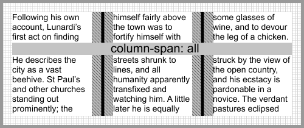

# CSS Multi-column Layout Module Level 1

#### W3C Working Draft, 12 February 2021

## 抄録

本仕様書は、Web 用スタイルシート言語である CSS における複数カラムレイアウトについて規定する。本仕様で規定されている機能を利用して、コンテンツを複数の列の間に隙間やルールを設けて流すことができる。

CSSは、構造化された文書（HTMLやXMLなど）の画面や紙面などでの描画を記述するための言語である。

## この文書のステータス

このセクションでは、この文書の発行時の状態を説明します。他の文書がこの文書に取って代わることがある。現在のW3C出版物及びこの技術報告書の最新改訂版のリストは、https://www.w3.org/TR/ のW3C技術報告書インデックスに掲載されている。

この文書は、CSS作業部会が作業草案として発行したものである。ワーキングドラフトとして出版されたことは、W3C メンバーシップによる承認を意味するものではない。

この文書は草案であり、いつでも他の文書に更新されたり、置き換えられたり、廃止されたりする可能性がある。この文書を作業中以外のものとして引用することは不適切です。

以下のように、タイトルに仕様コード "css-multicol" を含めて GitHub に課題を提出することでフィードバックを送ってください (推奨)。"[css-multicol] ...コメントの要約...." のようにしてください。すべての問題とコメントはアーカイブされます。また、(アーカイブされた)公開メーリングリスト www-style@w3.org にフィードバックを送ることもできます。

この文書は、2020年9月15日のW3Cプロセス文書に準拠する。

この文書は、W3C特許ポリシーの下で運営されているグループによって作成された。W3Cは、グループの成果物に関連して行われた特許開示の公開リストを維持している。本質的クレームを含むと考えられる特許を実際に知っている個人は、W3C特許ポリシーの第6項に従って情報を開示しなければならない。

## 1. 序章

(このセクションは規範ではありません)。

このモジュールでは、CSSにおける複数列レイアウトについて説明する。このドキュメントで説明する機能を使用することで、スタイルシートは、要素の内容を複数の列にレイアウトすることを宣言することができます。

CSS の他のレイアウト方法は、親要素に適用されると、直接の子要素の表示プロパティを変更する。例えば、3列のグリッド・レイアウトが作成された場合、グリッド・コンテナの直接の子要素はグリッド・アイテムとなり、必要に応じて追加の行が作成され、セルごとに 1つの要素がカラム・トラックに配置されます。

しかし、マルチカラムコンテナの子要素は通常のフローを継続し、そのフローは複数のカラムに配置されます。これらの列は柔軟なインラインサイズを持っているため、表示される列のサイズや数を変更することで利用可能なスペースに対応します。

複数カラムのレイアウトは、CSSで記述するのは簡単です。以下に簡単な例を示します。

#### 例1

```
body { column-width: 12em }
```

> 正確なカラム数は利用可能なスペースに依存します。

カラム数はスタイルシートで明示的に設定することもできます。

#### 例2

```
body { column-count: 2 }
```

> この場合、カラムの数は固定で、カラムの幅は利用可能な幅に応じて変化します。

短縮型のcolumnsプロパティを使用して、1つの宣言でどちらか、または両方のプロパティを設定することができます。

#### 例3
これらの例では、カラムの数、カラムの幅、および数と幅の両方がそれぞれ設定されています。

```
body { columns: 2 }
body { columns: 12em }
body { columns: 2 12em }
```

このモジュールで導入されたもう一つのプロパティ群は、カラム間のギャップとルールを記述します。

#### 例4

```
body {
  column-gap: 1em;
  column-rule: thin solid black;
}
```

> 上の例の最初の宣言では、隣接する2つの列の間のギャップを1emに設定しています。列の隙間はパディング領域に似ています。隙間の中央には、column-ruleプロパティによって記述されるルールがあります。

column-ruleプロパティの値は、CSSのborderプロパティの値と似ています。border と同様に、column-rule は短縮プロパティです。

#### 例5

この例では、上記の例の短縮型のcolumn-rule宣言を展開しています。

```
body {
  column-gap: 1em;
  column-rule-width: thin;
  column-rule-style: solid;
  column-rule-color: black;
}
```

column-fillとcolumn-spanプロパティは、スタイルシートに複数列レイアウトの視覚的表現の幅を与えます。

#### 例6

この例では、列はバランスがとれている、つまりほぼ同じ長さになるように設定されています。また、h2 要素はすべての列にまたがるように設定されています。

```
div { column-fill: balance }
h2 { column-span: all }
``` 

この仕様では、10個の新しいプロパティを導入していますが、そのすべてが上記の例で使用されています。

すべての列プロパティが初期値を持つ場合、要素のレイアウトは、1つの列だけを持つ複数列レイアウトと同じになります。

#### 例7

> 列の段間（斜めのハッチング）と列のルーラー（定規）は、パディング（十字のハッチング）を持つ複数列コンテナのこのサンプルのレンダリングで示されています。ハッチングされた部分は、説明のためだけに存在しています。実際の実装では、これらの領域は背景によって決定されます。2番目の画像は、列のルーラー（定規）を持つ複数列コンテナのレンダリングを示しています。


<!-- {width=xxx} -->

### 1.1. 値の定義

本仕様は、[CSS-VALUES-3]の値定義構文を用いて、[CSS21]のCSSプロパティ定義規定に従う。本仕様で定義されていない値の型は、CSS Values & Units [CSS-VALUES-3]で定義されている。他のCSSモジュールと組み合わせることで、これらの値型の定義が拡張されることがある。

定義に列挙されているプロパティ固有の値に加えて、本仕様で定義されているすべてのプロパティは、CSS全体のキーワードをプロパティ値としても受け入れる。可読性のために、それらは明示的に繰り返していない。

### 2. マルチカラムモデル

column-width または column-count プロパティが auto でない要素は、マルチカラムコンテナ（略して multicol コンテナ）を確立し、マルチカラムレイアウトのためのコンテナとして機能する。

従来のCSSボックス・モデルでは、要素の内容は対応する要素のコンテンツ・ボックスに流れ込みます。マルチカラム・レイアウトでは、カラム・ボックス（略してカラム）と呼ばれる匿名の断片化コンテナで形成された断片化コンテキストが導入されます。これらのカラム・ボックスは、マルチカラム・コンテナのコンテンツが流れる独立したブロック・フォーマット・コンテキストを確立し、その非配置子要素のための包含ブロックを形成します。

#### 例8

> この例では、このようなルールで画像の幅を設定しています。

```
img { 
  display: block. 
  width: 100%. 
}
```

> カラムボックスが新しいブロックフォーマットのコンテキストを作成することを考えると、幅はカラムボックスに対して相対的に計算されます。そのため、画像がカラムボックスからはみ出すことはありません。


#### 例9

> カラムボックスが新しいブロックフォーマットのコンテキストを作成することを考えると、multicolコンテナの最初の子要素に設定されたトップマージンは、multicolコンテナの余白では崩れません。


複数列レイアウト内に表示されるフロートは、フロートが表示される列ボックスを基準にして配置されます。

#### 例10

> この例では、この CSS フラグメントは画像の表示を記述しています。

```
img { 
  display: block. 
  float: right.
}
```

> HTMLでは、「鶏の足」という文末の後に画像が表示されます。


ブロック軸の列ボックスでオーバーフローした内容が断片化され、次の列ボックスで継続されます。

> 注：無名のボックスである列ボックスは、絶対的に配置されたボックスの包含ブロックにはなりません。そのようなボックスのための包含ブロックを確立する position プロパティは、マルチコルコンテナに適用され、それが主ボックスとなります。

#### 例11

> この例では、『multi-column container』は『position: relative』、これによって内容ブロックになります。画像は複数列コンテナの直接の子であり、『position: absolute』を持ちます。画像は、複数列コンテナの位置を取り、カラムボックスの位置ではなく、複数列コンテナの位置を取ります。

```
.container {
  position: relative;
  column-count: 3;
}
img {
  position: absolute;
  top: 20px;
  left: 40px;
}
```


カラムボックスは、マルチコルコンテナのインラインベース方向に並べられ、マルチコルラインに配置されています。カラム幅は、インライン方向のカラムボックスの長さです。カラムの高さは、ブロック方向のカラムボックスの長さである。行内のすべてのカラムボックスは同じカラム幅を持ち、行内のすべてのカラムボックスは同じカラム高さを持つ。

マルチカラムコンテナ内の各マルチカラム行内では、隣接するカラムボックスはカラムギャップによって区切られており、その中にはカラムルールが含まれている場合があります。同じ複数列コンテナ内のすべての列ギャップは等しくなります。同じ複数列コンテナ内のすべての列規則が表示されている場合は、それもすべて等しくなります。

最も単純なケースでは、マルチカラムコンテナは1行のカラムのみを含み、各カラムの高さはマルチカラムコンテナのコンテンツボックスの使用済みの高さと同等になります。しかし、断片化またはスパナは、マルチカラムコンテナの内容を複数のマルチカラム行に分割することができます。

複数列コンテナがページ分割されている場合、各列の高さはページによって制約され、内容は次のページの列ボックスの新しい行に続けられます。

この効果は、スパング要素が複数列のコンテナを分割したときにも同じです：スパング要素の前の列は、その内容に合わせてバランスが取れて短くなります。スパニング要素の後の内容は、新しい行の後続の列ボックスに流れ込みます。

#### 例12



したがって、マルチカラムコンテナは、その内容が一連のマルチカラム行とマルチカラムスパナで構成された新しい独立した書式設定コンテキストを確立する通常のブロックコンテナです。各マルチカラム行は、そのカラムボックスのためにマルチカラム書式設定コンテキストを確立するブロックレベルボックスとして動作し、各スパナは、通常通り、その表示値に応じた型で独立した書式設定コンテキストを確立するブロックレベルボックスとして動作します。

入れ子になった複数列コンテナは許可されていますが、実装固有の制限がある場合があります。

> 注意：カラムボックスにプロパティ/値を設定することはできません。例えば、特定のカラムボックスの背景を設定することはできませんし、カラムボックスにはパディング、マージン、ボーダーの概念がありません。将来の仕様では、追加機能が追加される可能性があります。例えば、幅の異なるカラムや背景の異なるカラムがサポートされるかもしれません。

> 注意：ビューポートよりもカラムの高さが大きいマルチコルコンテナは、アクセシビリティの問題を引き起こす可能性があります。

### 3. コラムの数と幅

複数カラムのコンテンツをレイアウトする際には、カラムの数と幅を見つけることが基本となります。これらのプロパティは、カラム数と幅を設定するために使用されます。

* column-count
* column-width

3番目のプロパティであるcolumnsは、column-widthとcolumn-countの両方を設定する略式プロパティです。

明示的な列の区切り、内容、高さの制約などの他の要因が、実際の列の数や幅に影響を与えることがあります。

### 3.1. 列のサイス：column-widthプロパティ

|名前|列幅|
|-|-|
|値 |auto または 長さ『0〜∞』|
|初期値|auto|
|適用対象|block containers except table wrapper boxes|
|継承|なし|
|割合|該当なし|
|計算値|the keyword auto or 絶対値|
|正準順序|文法ごと|

このプロパティは、マルチコルコンテナ内のカラムの幅を記述します。

* __auto__
カラムの幅が他のプロパティ(例えば、自動ではない値を持っている場合は、カラムカウント)によって決定されることを意味します。

* __<length [0,∞]>__
最適なカラム幅を記述します。実際の列幅は、（利用可能なスペースを埋めるために）広くしてもよいし、（利用可能なスペースが指定された列幅よりも小さい場合のみ）狭くしてもよい。負の値は認められません。使用される値は、最小1pxにクランプされます。

#### 例13

> 例えば、以下のスタイルシートを考えてみましょう。

```
div {
  width: 100px;
  column-width: 45px;
  column-gap: 0;
  column-rule: none;
}
```

> 幅100pxの要素の中には、幅45pxのカラムが2つ入る余地があります。空いたスペースを埋めるために、実際のカラムの幅は50pxに増加します。

#### 例14

> また、このスタイルシートも考えてみてください。

```
div {
  width: 40px;
  column-width: 45px;
  column-gap: 0;
  column-rule: none;
}
```

> 空いているスペースは指定された列幅よりも小さくなるため、実際の列幅は小さくなります。

縦書きのテキストでもカラム幅が使えるようにするために、カラム幅とは、カラム内の行ボックスの長さを意味します。

> 注意：列幅を多少柔軟にする理由は、多くの画面サイズに対応できるスケーラブルなデザインを実現するためです。正確なカラム幅を設定するには、カラムギャップとマルチコルコンテナの幅（横書きテキストを想定）も指定する必要があります。